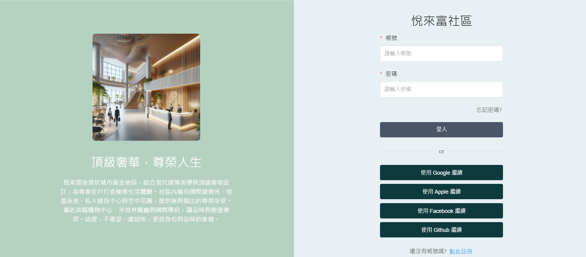
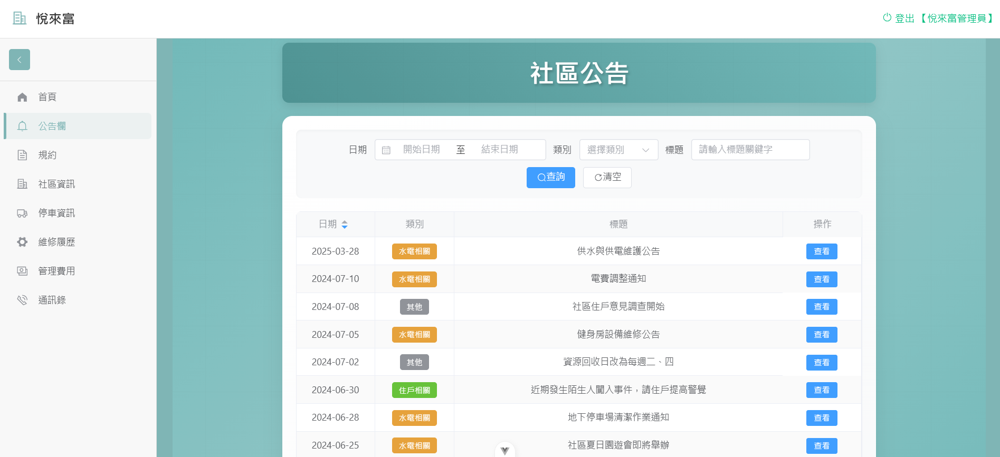

# 智慧社區管理系統 - 前端用戶介面

> 本專案為一套針對現代化社區需求所開發的智慧社區管理系統之前端用戶介面。透過數位平台簡化社區資訊傳遞、維修申報與停車管理等功能，提升住戶生活便利性及社區管理效率。

## 🧩 專案簡介（簡要）

本系統源自實際觀察社區管理上的痛點：

- 公告與規約紙本化，資訊傳遞不易
- 維修流程繁瑣，難以即時追蹤
- 停車、管理費、通訊資訊分散管理

本專案透過數位化整合，讓住戶可透過網站平台快速取得所需社區資訊，並提供直觀操作介面提升使用體驗。

---

## 🔧 安裝說明（Vue 3 環境）

```bash
# 1. 安裝依賴套件
npm install

# 2. 啟動開發伺服器
npm run dev

# 3. 編譯生產環境版本
npm run build
```

✅ 使用技術：Vue 3 + Vue Router + Element Plus + Axios

後台管理頁面請參照: [智慧社區管理系統 - 後台管理介面Angular](https://github.com/noveres/WuyeGuanli_NG)

後端設計請參照: [智慧社區管理系統 - 後端資料處理Spring Boot](https://github.com/chikenouo/WuyeGuanli)

---

## 🚀 功能簡介（Frontend）

| 功能模組             | 主要說明                                                 |
|----------------------|----------------------------------------------------------|
| 公告及規約查詢       | 數位化公告與規約資料，提供快速搜尋與條件篩選              |
| 社區資訊             | 顯示社區歷史背景、設施與管委會成員聯絡資訊                |
| 維修申報與追蹤       | 線上提交報修單，追蹤處理進度，並有統計報表分析              |
| 停車資訊管理         | 查詢車位租賃與繳費狀況，查看匯款紀錄                        |
| 個人管理費資訊       | 查看年度繳費紀錄與明細                                     |
| 社區通訊錄           | 整合社區廠商、住戶、緊急聯絡資訊，集中管理                  |

---

## 🌱 未來拓展

- 🧠 **AI智能分析報表**：自動分析繳費狀況、維修頻率，幫助管理員優化財務與維修計劃。  
- 📲 **行動推播通知**：公告即時推送到住戶手機  
- 🌐 **多語系支援**：適應多元社區住戶語言需求  
- 📦 **IOT 技術整合**：如智能置物櫃、門禁與環境感測等裝置串接  

